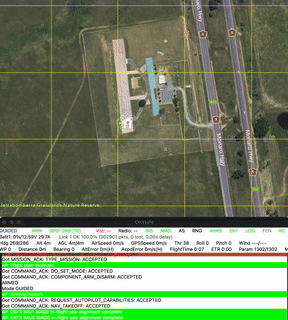

This repository contains Ardupilot applications written in both Python and C. We used both Arducopter and ArduPlane targets to build and run different modes on SITL board. 

## Install Ardupilot

Follow [Ardupilot instructions](https://github.com/ArduPilot/ardupilot/blob/master/BUILD.md) to install for the configurations listed below: 

- Board: sitl 
- Vehicle types: copter, plane

## Install ArduPilot DroneKit Python

Install [DroneKit](https://github.com/dronekit/dronekit-sitl#dronekit-sitl) API. 

```
pip install dronekit-sitl
dronekit-sitl <copter(-version)> [parameters]
```

## Running Ardupilot modes
Run the `simvehicle.py` tool on one terminal and use another terminal for the next step.
```
sim_vehicle.py -v ArduCopter --console --map
```
This will spawn a drone, which is ready to be connected in this TCP address: 127.0.0.1:14550

Now, use another terminal to clone this repository and run different modes: 

```
cd auto_mode
python waypoints.py --connect 127.0.0.1:14550
```

This will connect to the drone launched by `simvehicle.py` and run the waypoints mission. Similarly, other modes could be tested.



## Install Mavlink library for building C++ applications
Clone the repository recursively to pull all submodules including `ardupilot` and `MAVSDK`
```bash
git clone --recursive git@github.com:VUISIS/ArduPilot-Modes.git
```

If the `Ardupilot-Modes` project is not cloned with the `--recursive` flag previously, pull [Mavlink](https://mavsdk.mavlink.io) as a submodule again.
```bash
cd ArduPilots-Modes
git submodule update --init --recursive
```

Install dependencies for building `MAVSDK`
```bash
sudo apt update
sudo apt install python3-pip
```

Building `MAVSDK`
```bash
cd modules/MAVSDK/
cmake -Bbuild/default -DCMAKE_BUILD_TYPE=Release -H.
cmake --build build/default -j8
```

Installing the C++ Library locally with a specific dialect selected for Ardupilot. If some libraries are missing when building, recursively pull submodules inside `MAVSDK` repository and try again.
```bash
cd modules/MAVSDK/
cmake -Bbuild -H. -DCMAKE_INSTALL_PREFIX=install -DMAVLINK_DIALECT=ardupilotmega -DMAVLINK_VERSION=2.0 
cmake --build build --target install
```

## Building and running C++ application examples
Building an application example
```bash
cd auto_mode/c/
cmake -Bbuild -H. -DCMAKE_PREFIX_PATH=$(pwd)/../../modules/MAVSDK/install 
cmake --build build -j8
```

Start SITL (Software in the Loop) for simulation by following the official [SITL testing tutorial](https://ardupilot.org/dev/docs/using-sitl-for-ardupilot-testing.html) for installation and running the command below.
```bash
sim_vehicle.py -v Copter --console --map
```

Running an application example
```bash
./build/waypoints tcp://:5762
```

Optionally, A bash script is provided to automate the building and running of application examples. Make sure that the `MAVSDK` C++ library is installed and `SITL` is running in the background following the previous steps, then execute the `run.sh` script inside root directory.
```bash
# Please specify mode: AUTO, GUIDED, AVOID
. ./run.sh AUTO
```